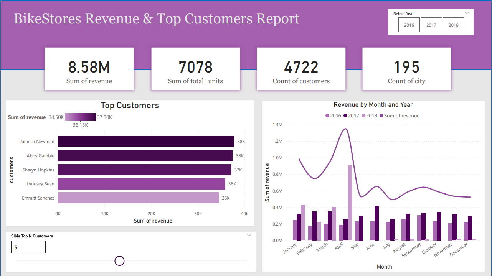

# 🚴‍♂️ BikeStores Power BI Sales Analysis Dashboard

This project presents an interactive **Power BI dashboard** for analyzing sales performance at **BikeStores**, a fictional multi-store bicycle retailer. The report showcases key metrics related to revenue, top customers, sales by brand, and performance by category across multiple years.

## 💡 Usage

- Open `BikeStores_reports.pbit` in **Power BI Desktop**.
- Review and explore the visualizations, or customize them for further insight.
- Use the Excel dataset to extend or update analysis as new data becomes available.

**Author**: *Mohamad Kaser*  
**Last Updated**: June 2025
